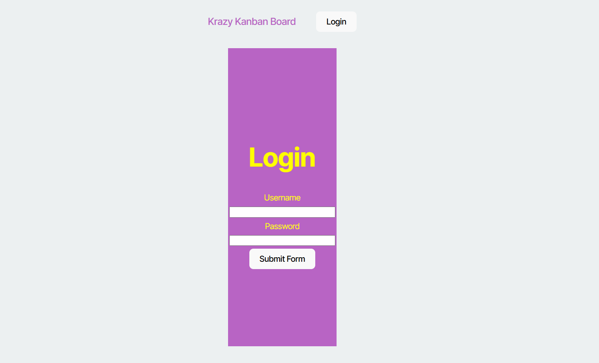
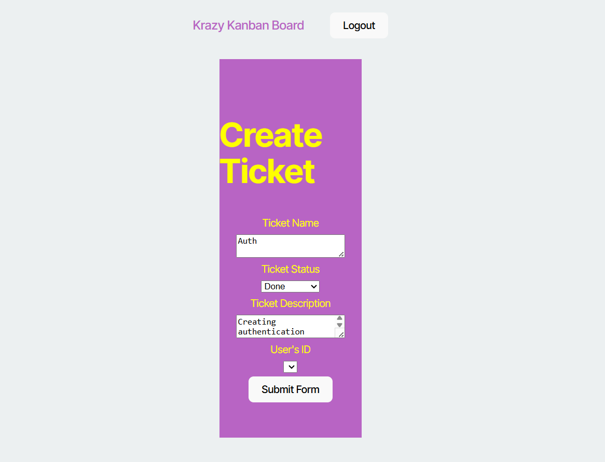
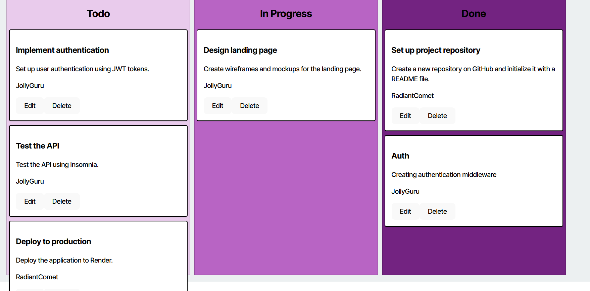

# kanban
KanBan board for tracking goals that utilizes JWT authentication.

## Table of Contents
- [Description](#description)
- [Installation Instructions](#installation-instructions)
- [Link](#link)
- [License](#license)

## Description
This application allows users to log in to a web application utilizing JWT token encryption. Once inside of the application, the user can create to-do lists in kanban fashion.

Log in

Create a Ticket

View Kanban board

## Installation Instructions
Follow the link to the run the deployed application. If using locally, run in terminal 'npm install' followed by 'npm run build' and 'npm run start'. 

## Link
https://kanban-36eq.onrender.com

## License

This project is licensed under the [MIT](https://opensource.org/licenses/MIT) license.

